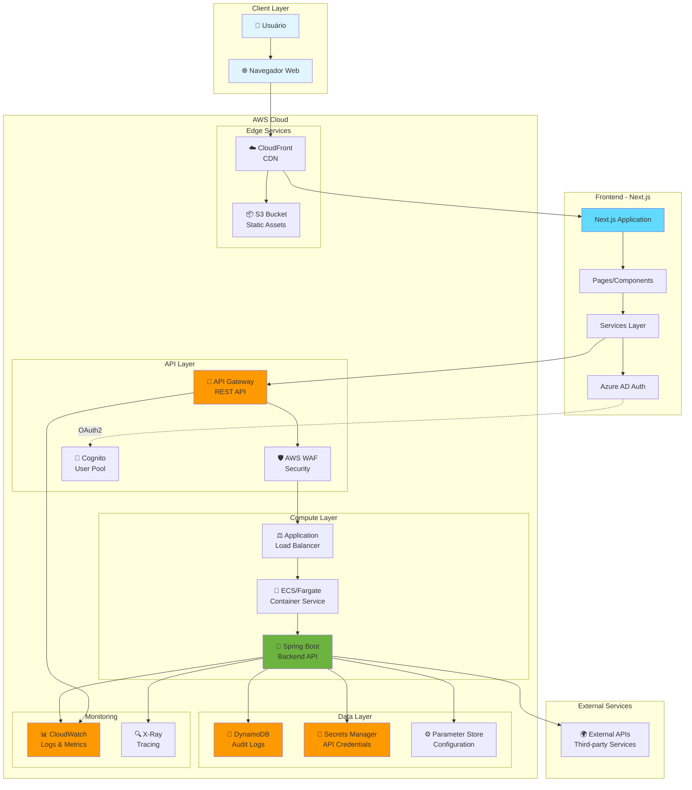
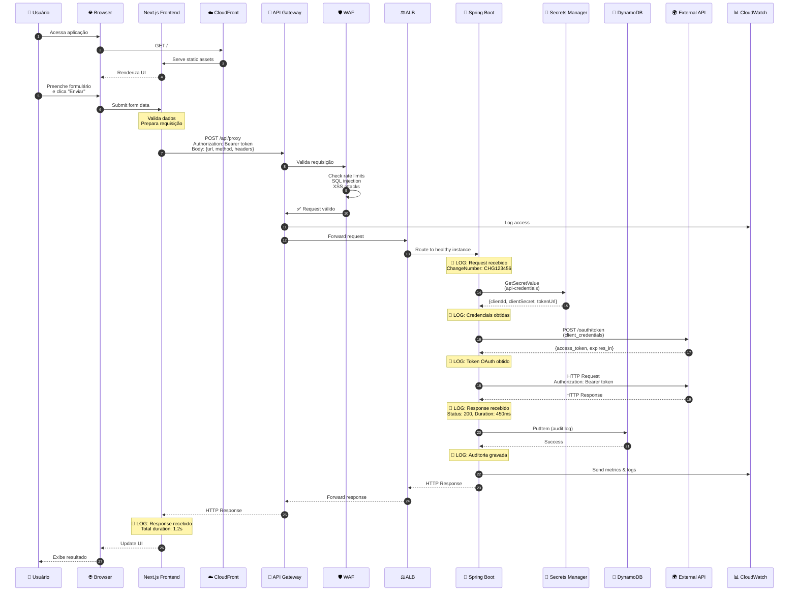
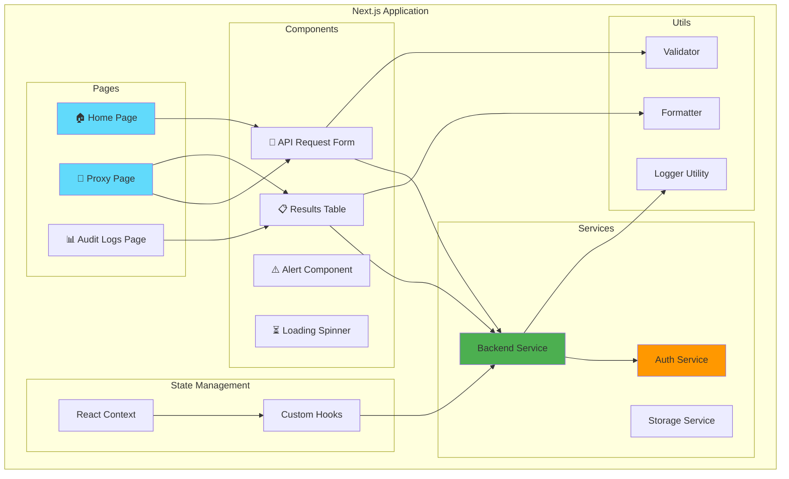
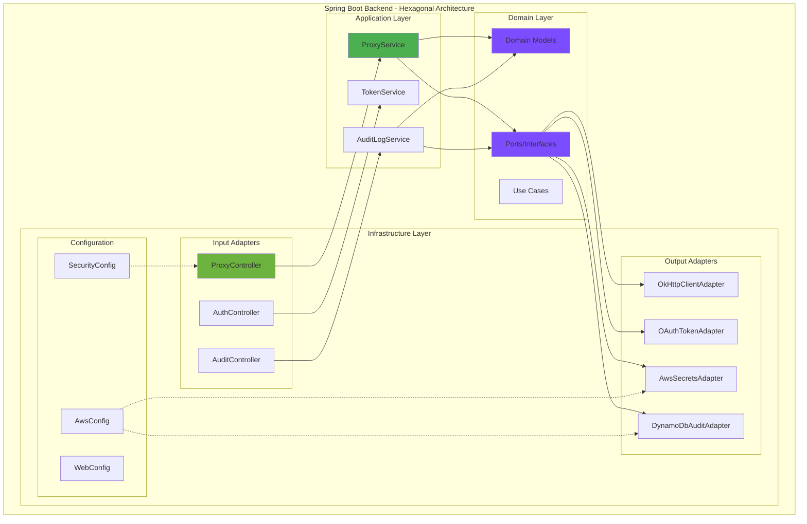
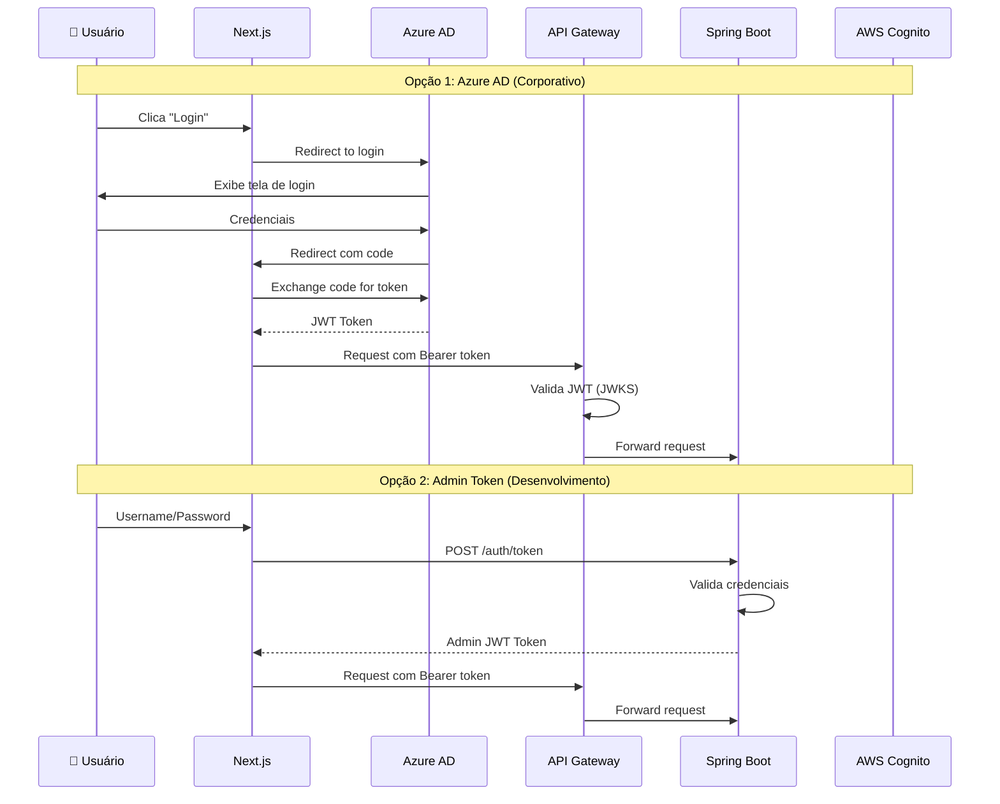
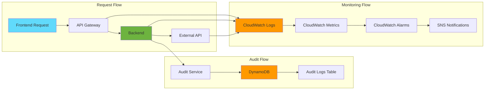
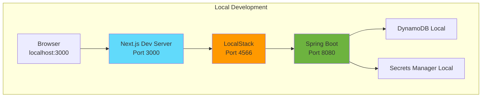
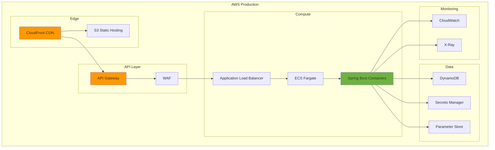
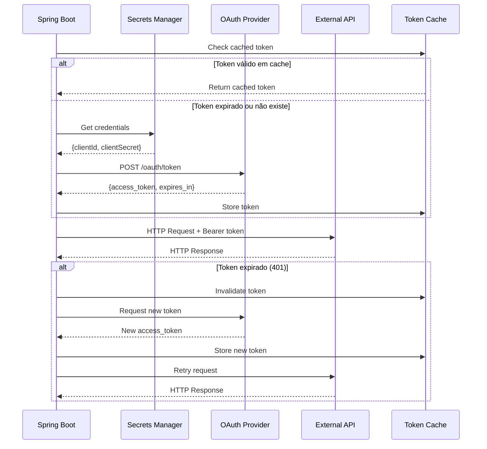
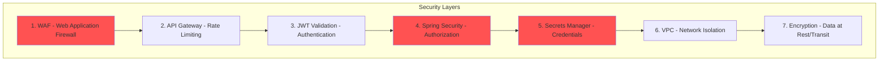

# Arquitetura Completa - API Generic Consumer

## 📋 Visão Geral

Este documento apresenta a arquitetura completa do sistema API Generic Consumer, mostrando a interação entre Frontend (Next.js), API Gateway (AWS), Backend (Spring Boot) e serviços AWS.

## 🏗️ Arquitetura Geral



## 🔄 Fluxo de Requisição Completo



## 🎯 Componentes Detalhados

### 1. Frontend (Next.js)



#### Estrutura de Arquivos Frontend

```
api-generic-consumer-frontend/
├── src/
│   ├── app/                    # Next.js App Router
│   │   ├── page.tsx           # Home page
│   │   ├── proxy/
│   │   │   └── page.tsx       # Proxy page
│   │   └── audit/
│   │       └── page.tsx       # Audit logs page
│   │
│   ├── components/            # React Components
│   │   ├── ApiRequestForm.tsx
│   │   ├── ResultsTable.tsx
│   │   ├── AlertMessage.tsx
│   │   └── LoadingSpinner.tsx
│   │
│   ├── services/              # API Services
│   │   ├── backend.service.ts # Backend API calls
│   │   ├── auth.service.ts    # Authentication
│   │   └── storage.service.ts # Local storage
│   │
│   ├── hooks/                 # Custom React Hooks
│   │   ├── useApi.ts
│   │   ├── useAuth.ts
│   │   └── useLogger.ts
│   │
│   ├── utils/                 # Utilities
│   │   ├── logger.ts          # Logging utility
│   │   ├── validator.ts       # Input validation
│   │   └── formatter.ts       # Data formatting
│   │
│   └── types/                 # TypeScript types
│       ├── api.types.ts
│       └── auth.types.ts
│
├── public/                    # Static assets
├── .env.local                 # Environment variables
└── package.json
```

### 2. Backend (Spring Boot)



#### Estrutura de Arquivos Backend

```
api-generic-consumer-backend/
├── src/main/kotlin/com/apiconsumer/
│   ├── domain/                          # Domain Layer
│   │   ├── model/
│   │   │   ├── ApiRequest.kt
│   │   │   ├── ApiResponse.kt
│   │   │   ├── ApiCredentials.kt
│   │   │   └── AuditLogEntry.kt
│   │   └── port/
│   │       ├── input/
│   │       │   ├── ExecuteProxyUseCase.kt
│   │       │   └── WriteAuditLogUseCase.kt
│   │       └── output/
│   │           ├── HttpClientPort.kt
│   │           ├── TokenProviderPort.kt
│   │           ├── SecretsManagerPort.kt
│   │           └── AuditLogRepositoryPort.kt
│   │
│   ├── application/                     # Application Layer
│   │   └── service/
│   │       ├── ProxyService.kt
│   │       ├── AuditLogService.kt
│   │       └── TokenService.kt
│   │
│   └── infrastructure/                  # Infrastructure Layer
│       ├── adapter/
│       │   ├── input/
│       │   │   └── web/
│       │   │       ├── ProxyController.kt
│       │   │       ├── AuthController.kt
│       │   │       └── AuditLogController.kt
│       │   └── output/
│       │       ├── http/
│       │       │   └── OkHttpClientAdapter.kt
│       │       ├── oauth/
│       │       │   └── OAuthTokenAdapter.kt
│       │       ├── aws/
│       │       │   └── AwsSecretsAdapter.kt
│       │       └── dynamodb/
│       │           └── DynamoDbAuditLogAdapter.kt
│       └── config/
│           ├── AwsConfig.kt
│           ├── DynamoDbConfig.kt
│           ├── SecurityConfig.kt
│           └── WebConfig.kt
│
├── src/main/resources/
│   ├── application.yml
│   └── application-prod.yml
│
└── build.gradle.kts
```

## 🔐 Fluxo de Autenticação



## 📊 Fluxo de Dados e Auditoria



## 🗄️ Modelo de Dados DynamoDB

```mermaid
erDiagram
    AUDIT_LOGS {
        string changeNumber PK
        string timestamp SK
        string level
        string message
        string tableData
        number ttl
        string requestId
        string userId
        string method
        string url
        number statusCode
        number duration
    }
    
    AUDIT_LOGS ||--o{ SESSION : "belongs to"
    
    SESSION {
        string changeNumber
        datetime openedAt
        datetime closedAt
        number totalCalls
        number successCalls
        number errorCalls
    }
```

### Estrutura da Tabela audit-logs

| Campo | Tipo | Descrição | Exemplo |
|-------|------|-----------|---------|
| **changeNumber** | String (PK) | Identificador da sessão | CHG123456 |
| **timestamp** | String (SK) | ISO 8601 timestamp | 2026-05-07T12:00:00.000Z |
| **level** | String | Nível do log | SESSION_OPEN, CALL, SESSION_CLOSE |
| **message** | String | Mensagem descritiva | "Requisição executada com sucesso" |
| **tableData** | String (JSON) | Dados estruturados | {"url": "...", "status": 200} |
| **ttl** | Number | Time to live (30 dias) | 1715097600 |
| **requestId** | String | ID único da requisição | uuid-v4 |
| **userId** | String | ID do usuário | user@example.com |
| **method** | String | Método HTTP | GET, POST, PUT, DELETE |
| **url** | String | URL da API externa | https://api.example.com/v1/resource |
| **statusCode** | Number | Status HTTP | 200, 404, 500 |
| **duration** | Number | Duração em ms | 450 |

## 🌍 Ambientes de Deployment

### Ambiente Local (Desenvolvimento)



### Ambiente AWS (Produção)



## 🔄 Integração com APIs Externas



## 📈 Métricas e Monitoramento

### CloudWatch Dashboards

```
┌─────────────────────────────────────────────────────────────┐
│ API Generic Consumer - Production Dashboard                 │
├─────────────────────────────────────────────────────────────┤
│                                                              │
│ 📊 API Gateway Metrics                                      │
│   • Requests/min: 1,250                                     │
│   • 4XX Errors: 2.1%                                        │
│   • 5XX Errors: 0.3%                                        │
│   • Latency P50: 180ms | P95: 450ms | P99: 850ms          │
│                                                              │
│ 🔧 Backend Metrics                                          │
│   • Active Instances: 4                                     │
│   • CPU Utilization: 45%                                    │
│   • Memory Usage: 62%                                       │
│   • Request Duration: 320ms avg                             │
│                                                              │
│ 💾 DynamoDB Metrics                                         │
│   • Read Capacity: 125 RCU                                  │
│   • Write Capacity: 85 WCU                                  │
│   • Throttled Requests: 0                                   │
│   • Item Count: 1.2M                                        │
│                                                              │
│ 🌍 External API Metrics                                     │
│   • Success Rate: 98.7%                                     │
│   • Avg Response Time: 280ms                                │
│   • Timeout Rate: 0.5%                                      │
│                                                              │
└─────────────────────────────────────────────────────────────┘
```

## 🚨 Alertas Configurados

| Alerta | Condição | Ação |
|--------|----------|------|
| **High Error Rate** | 5XX > 5% por 5 min | SNS → Email + Slack |
| **High Latency** | P95 > 2s por 5 min | SNS → Email |
| **DynamoDB Throttling** | Throttled > 10 por min | SNS → Email |
| **Backend Unhealthy** | Health check fail > 3 | Auto-scaling + SNS |
| **External API Down** | Failures > 50% por 2 min | SNS → PagerDuty |

## 🔒 Segurança

### Camadas de Segurança



### Práticas de Segurança Implementadas

1. **HTTPS Everywhere**: Todas as comunicações via TLS 1.2+
2. **Token-based Auth**: JWT com Azure AD ou Admin tokens
3. **Secrets Management**: Credenciais em AWS Secrets Manager
4. **Rate Limiting**: Proteção contra DDoS
5. **Input Validation**: Validação de todos os inputs
6. **CORS**: Configuração restritiva de origens permitidas
7. **Audit Logging**: Registro de todas as operações
8. **Encryption**: Dados em repouso e em trânsito criptografados

## 📚 Documentação Adicional

- [Backend Architecture](../api-generic-consumer-backend/docs/ARCHITECTURE.md)
- [Backend Logging Guide](../api-generic-consumer-backend/docs/LOGGING.md)
- [Integrated Testing Guide](./README-INTEGRATED-TEST.md)
- [API Documentation](../api-generic-consumer-backend/docs/API.md)

## 🚀 Quick Start

### Desenvolvimento Local
```bash
# Frontend
cd api-generic-consumer-frontend
npm install
npm run dev

# Backend
cd api-generic-consumer-backend
./gradlew bootRun

# Testes Integrados
cd api-generic-consumer-frontend
./start-integrated-test.bat  # Windows
./start-integrated-test.sh   # Linux/Mac
```

### Deploy AWS
```bash
# Frontend (S3 + CloudFront)
npm run build
aws s3 sync out/ s3://your-bucket/
aws cloudfront create-invalidation --distribution-id XXX --paths "/*"

# Backend (ECS)
docker build -t api-consumer-backend .
docker tag api-consumer-backend:latest ECR_URI:latest
docker push ECR_URI:latest
aws ecs update-service --cluster prod --service api-consumer --force-new-deployment
```

---

**Última atualização**: 2026-05-07  
**Versão**: 1.0.0  
**Autor**: Equipe de Desenvolvimento