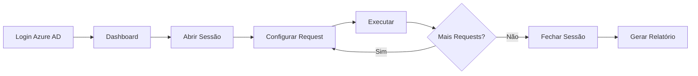

# API Generic Consumer Frontend

[](LICENSE)
[](https://nextjs.org/)
[](https://reactjs.org/)
[](https://www.typescriptlang.org/)

Interface web moderna para consumo genérico de APIs com autenticação Azure AD, gerenciamento de sessões e auditoria completa.

## 🚀 Features

- ✅ Interface intuitiva para consumo de APIs
- ✅ Autenticação via Azure AD (MSAL)
- ✅ Gerenciamento de sessões de teste
- ✅ Visualização de respostas formatadas
- ✅ Upload de arquivos
- ✅ Mascaramento de dados sensíveis (PII)
- ✅ Geração de relatórios de sessão
- ✅ Integração com API Gateway AWS
- ✅ Dark mode ready
- ✅ Responsive design

## 📋 Pré-requisitos

- **Node.js** 20+
- **npm** ou **yarn**
- **Docker** (para testes E2E)

## 🏃 Quick Start

### Desenvolvimento Local

```bash
# 1. Clone o repositório
git clone <repository-url>
cd api-generic-consumer-frontend

# 2. Instale dependências
npm install

# 3. Configure variáveis de ambiente
cp .env.example .env.local
# Edite .env.local com suas configurações

# 4. Execute em modo desenvolvimento
npm run dev

# 5. Acesse a aplicação
# http://localhost:3000
```

### Build para Produção

```bash
# Build estático
npm run build

# Servir localmente
npm start
```

### Docker

```bash
# Build da imagem
docker build -t api-consumer-frontend .

# Executar container
docker run -p 3000:80 api-consumer-frontend
```

## 🔧 Configuração

### Variáveis de Ambiente

Crie um arquivo `.env.local` baseado no `.env.example`:

```bash
# Backend API (pode ser direto ou via API Gateway)
NEXT_PUBLIC_BACKEND_URL=http://localhost:8080

# Azure AD Configuration
NEXT_PUBLIC_AZURE_CLIENT_ID=your-azure-client-id
NEXT_PUBLIC_AZURE_TENANT_ID=your-tenant-id
NEXT_PUBLIC_AZURE_REDIRECT_URI=http://localhost:3000
```

### Configuração para API Gateway Local

Para testes com LocalStack:

```bash
# Obter API ID do LocalStack
API_ID=$(cat /tmp/api-gateway-id.txt)

# Configurar URL do API Gateway
NEXT_PUBLIC_BACKEND_URL=http://localhost:4566/restapis/$API_ID/local/_user_request_
```

## 📖 Documentação

- [Arquitetura](docs/ARCHITECTURE.md)
- [Setup Local](docs/LOCAL_SETUP.md)
- [Guia de Contribuição](CONTRIBUTING.md)

## 🎨 Estrutura do Projeto

```
src/
├── app/                    # Next.js App Router
│   ├── dashboard/         # Dashboard page
│   ├── login/            # Login page
│   ├── layout.tsx        # Root layout
│   └── page.tsx          # Home page
├── components/
│   ├── features/         # Feature components
│   │   ├── ApiTester.tsx
│   │   ├── RequestForm.tsx
│   │   ├── ResponseViewer.tsx
│   │   └── SessionBanner.tsx
│   └── ui/              # UI components
│       ├── Button.tsx
│       ├── Input.tsx
│       └── Select.tsx
├── services/            # API services
│   └── backend.service.ts
├── context/            # React contexts
│   └── ChangeSessionContext.tsx
├── auth/              # Authentication
│   ├── msalConfig.ts
│   └── useAuth.ts
├── lib/              # Utilities
│   ├── pii-mask.ts
│   ├── report.ts
│   └── utils.ts
└── types/           # TypeScript types
    └── index.ts
```

## 🧪 Testes

```bash
# Testes unitários
npm test

# Testes E2E
npm run test:e2e

# Lint
npm run lint
```

## 🐳 Docker Compose (E2E)

Para testar a aplicação completa com backend e LocalStack:

```bash
# Do diretório do backend
cd ../api-generic-consumer-backend
docker-compose -f docker-compose.e2e.yml up

# Acesse
# Frontend: http://localhost:3000
# Backend: http://localhost:8080
# LocalStack: http://localhost:4566
```

## 🔐 Autenticação

### Azure AD (Produção)

1. Configure um App Registration no Azure AD
2. Adicione redirect URI: `http://localhost:3000` (dev) ou sua URL de produção
3. Configure as variáveis de ambiente
4. O login será automático via MSAL

### Admin Token (Desenvolvimento)

Para testes locais sem Azure AD:

```typescript
// Obter token admin do backend
const response = await fetch('http://localhost:8080/auth/token', {
  method: 'POST',
  headers: { 'Content-Type': 'application/json' },
  body: JSON.stringify({
    username: 'admin',
    password: 'admin'
  })
});

const { token } = await response.json();
```

## 📊 Features Principais

### 1. API Tester

Interface para testar APIs externas:
- Suporte a GET, POST, PUT, DELETE, PATCH
- Headers customizados
- Body JSON
- Visualização de resposta formatada

### 2. Session Management

Gerenciamento de sessões de teste:
- Abertura/fechamento de sessão
- Tracking de chamadas
- Geração de relatórios
- Histórico de requisições

### 3. File Upload

Upload de arquivos para APIs:
- Suporte a múltiplos formatos
- Preview de arquivos
- Validação de tamanho

### 4. PII Masking

Mascaramento automático de dados sensíveis:
- CPF/CNPJ
- Email
- Telefone
- Cartão de crédito

### 5. Report Generation

Geração de relatórios de sessão:
- Markdown formatado
- Estatísticas de chamadas
- Tabela de URLs consumidas
- Download de relatório

## 🎯 Fluxo de Uso



## 🤝 Contribuindo

Contribuições são bem-vindas! Veja [CONTRIBUTING.md](CONTRIBUTING.md)

## 📄 Licença

MIT License - veja [LICENSE](LICENSE)

## 🔗 Links Relacionados

- [Backend Repository](../api-generic-consumer-backend)
- [API Documentation](../api-generic-consumer-backend/docs/API.md)
- [Architecture](docs/ARCHITECTURE.md)

## 🆘 Suporte

- 📧 Email: support@example.com
- 🐛 Issues: [GitHub Issues](https://github.com/org/repo/issues)
- 💬 Discussions: [GitHub Discussions](https://github.com/org/repo/discussions)

## 🗺️ Roadmap

- [ ] Suporte a GraphQL
- [ ] Temas customizáveis
- [ ] Exportação de coleções (Postman-like)
- [ ] Histórico persistente
- [ ] Colaboração em tempo real
- [ ] Integração com CI/CD

---

**Desenvolvido com ❤️ usando Next.js e React**